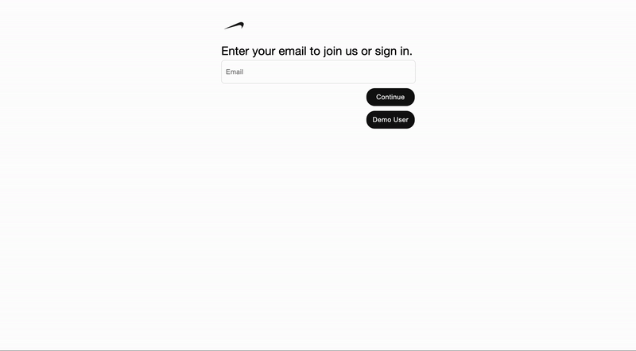
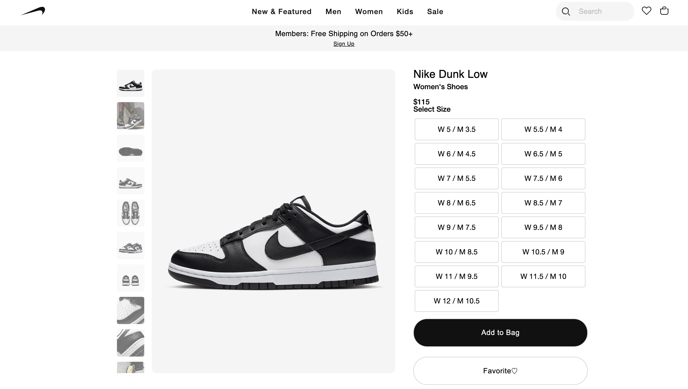

# Welcome to Sike

### [LIVE LINK](https://sike-73tj.onrender.com/)

Sike ('sīk) is a clone of [Nike.com](https://https://www.nike.com/) at the time of creation, with some creative and functional liberties. Nike, widely known for its apparel and footwear, is the largest sportswear company in the world in terms of revenue. Nike users are able to browse, favorite, review, and check out products. I have always been curious about the makeup of e-commerce and Nike's website presented a good learning experience, as it is one of the most aesthetically pleasing.

Technologies used:
* Languages: Javascript, Ruby, HTML, and CSS
* Frontend: React-Redux
* Database: PostgreSQL
* Hosting: Render
* Asset Storage: AWS Simple Cloud Storage (S3)

# Minimum Viable Product

## Authentication
Users attempting to login or sign up are presented with a dynamic email entry form. After checking for the email's existence in the database, the page loads the correct form, with the email address retained:

 

```rb
    def check_email
        email = params[:email].downcase
        exists = User.exists?(email: email)
        render json: { exists: exists }
    end
```

## Products
Users are able to view a variety of footwear and clothing, currently filtered as either "Men", "Women" or "Kids". Product pages contain information directly from Nike's website with the help of a [python script](https://github.com/rl1987/trickster.dev-code/tree/main/2023-05-15-scraping-product-data-from-nike). Images were downloaded and organized using a separate custom python script: 

 

```py
def download_image(img_url, folder, img_suffix):
    try:
        filename = f"{os.path.basename(folder)}-{img_suffix}.jpg" 

        response = requests.get(img_url)
        response.raise_for_status()

        with open(os.path.join(folder, filename), 'wb') as file:
            file.write(response.content)
    except Exception as e:
        print(f"Error downloading {img_url}: {e}")

def scrape_and_download(url):
    folder_name = url.rstrip('/').split('/')[-1]
    folder_path = os.path.join('downloaded_images', folder_name)
    os.makedirs(folder_path, exist_ok=True)

    options = Options()
    options.headless = True
    driver = webdriver.Chrome(service=Service(ChromeDriverManager().install()), options=options)

    driver.get(url)
    time.sleep(10)  

    parent_divs = driver.find_elements(By.CLASS_NAME, 'css-jpr23i')
    img_counter = 1
    for div in parent_divs:
        images = div.find_elements(By.TAG_NAME, 'img')
        for image in images:
            img_url = image.get_attribute('src')
            if img_url:
                download_image(img_url, folder_path, img_counter)
                img_counter += 1

    driver.quit()
```

This allowed thousands of pictures to get attached to the appropriate products with one function:

```rb
Product.all.each do |product|
  i = 1
  loop do
    begin
      photo_url = "https://sike-seeds.s3.amazonaws.com/#{product.article_number}/#{product.article_number}-#{i}.jpg"
      puts "Attaching image #{i} for product ##{product.id}"
      product.photos.attach(
        io: URI.open(photo_url),
        filename: "#{product.article_number}-#{i}.jpg"
      )
      i += 1
    rescue OpenURI::HTTPError => e
      puts "HTTP Error encountered: #{e.message}"
      break if e.message.include?('403 Forbidden')
    end
  end
end
```
